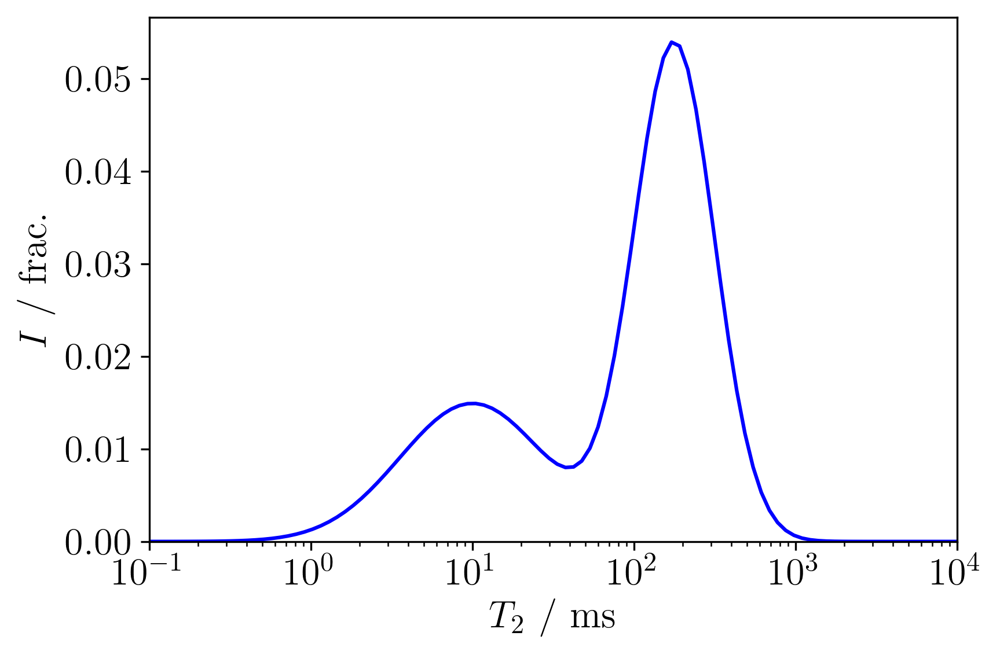

# t2-example-distributions

Synthetic distributions

This projects contains a collection of synthetic T2 relaxation spectra. 
By proividing the python code, I hope people can use it for modeling and inversion.
The code snippets show how one may generate synnthetic raw data with added noise directly from the T2 spectra.

Once the raw data is generated one may experiment with inversions to see how e.g. regularization affects the result.

